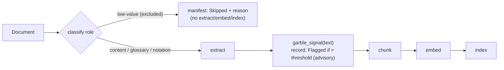

# ADR-0006 — Ingest quality: section filter + advisory garble flag

**Status:** Accepted · 2026-06-03
**Relates to:** requirements `docs/requirements.md` Addendum 2026-06-03 (QA-EQ1/EQ2, F-EQ.1/2,
*Considered and rejected*); ADR-0004 (hexagonal — ports vs domain logic); evidence
`experiments/quality/` on turbo (E1–E11).

## Context

Retrieval is only as good as the text indexed. An earlier draft of this ADR proposed an
autonomous *extraction-correctness scorer* feeding a whole-document quality gate, a
cheap-first *escalation ladder* of progressively stronger extractors, and an agentic-LLM
re-extraction rung. Before building it we ran an exploratory-experiment study over the real
corpus (E1–E11, `experiments/quality/` on turbo). The premise did not survive:

- The dominant retrieval pollution is **low-value boilerplate sections** — **13.7%** of book
  documents (7.9% by volume), and **0%** of papers (papers are not chaptered). This is the
  operator's actual complaint (index/bibliography fragments like "LCF, 389").
- **True garble is rare** — mojibake 1.0% (software) / 3.5% (physics, sparse), gross
  letter-spacing ≤0.2% — and what exists is mostly *subtle* (sits below any
  false-positive-safe threshold).
- **Omission** (silently-dropped equations/figures/pages) and **in-formula corruption**
  (scrambled-but-balanced math) are **provably invisible** to any signal computed from the
  extracted text alone (dropping 40% of a chapter's equations *improved* its prose signals).
- Extraction **crashes** (≤0.5%) already produce no output and are recorded `Failed` (F-1.6).
- Aggressive cleaning is low-yield/risky (de-hyphenation relevant to 2.3% of docs;
  letterspace-collapse corrupts code and legitimate single-letter sequences).

So this ADR records a far smaller decision than the original ambition.

## Decision

Adopt two cheap, deterministic measures and reuse the existing fault path. **Neither is a
new outbound port** — by ADR-0004's bar (a port earns its keep only with >1 implementation),
both are domain logic + config, like the query-side gate policy in ADR-0005.

**1. Section filter (F-EQ.1) — classify at intake, skip before extraction.**
Each `Document`'s *section role* is classified from its identity (declared type / chapter
name) against per-collection config, **before** extraction. Excluded low-value roles are
**skipped end-to-end** (no extract/chunk/embed/index) and recorded `Skipped` in the manifest
with the reason. Content sections, and useful reference sections (**glossary, notation**),
are retained by default; `keep` wins over `exclude`. Book-only; a no-op for un-chaptered
content. Classifying *before* extraction also saves marker + embedding cost on the excluded
13.7%.

**2. Garble flag (F-EQ.2) — compute after extraction, record, advise.**
After extraction, a per-document garble signal (U+FFFD replacement-char rate +
letter-spacing density) is computed over the `ExtractedText` and recorded in the manifest.
Above a configurable threshold the document is marked **advisory-`Flagged`** (a `quality`
manifest row) — ingestion proceeds regardless; `status` surfaces flagged documents for
operator review. Computed **doc-level** (the single-span extract output is sufficient — the
study scored doc-level) and keyed on **definitive garble markers, not symbol density**, so
correctly-extracted math is never flagged.

**3. Crashes — unchanged.** Caught by the per-document fault path (`Failed`, F-1.3/F-1.6);
`status` surfaces them. No new mechanism.

**Data flow:**



**Config (per-collection TOML):**
```toml
[quality.sections]
exclude = ["index","contents","cover","copyright","title","half-title",
           "acknowledgements","back-cover","references","bibliography"]
keep    = ["glossary","notation"]    # wins over exclude

[quality.garble]
flag_above = 1.0                      # composite of ufffd-rate + letterspace-density
```

**Manifest:** reuse the existing `Skipped` status for excluded sections (reason in `error`);
add a `quality` stage row carrying the garble signal, status `Flagged` (advisory) or
`Success`. The document's `index` row is unaffected — a flagged document is still
successfully indexed.

## Why this fits the drivers and the evidence

- **QA-EQ1** is met deterministically by the section filter — the dominant, prevalent
  problem — with no scorer and no risk to good content (auditable, `keep`-protected).
- **QA-EQ2** is met by a persisted, math-safe, advisory garble signal. No autonomous
  exclusion (a hard gate was rejected: it would catch little real garble while risking loss
  of good documents).
- **Honest scope:** omission / in-formula corruption are not attempted (proven undetectable
  from output, E4/E10).
- **ADR-0004 consistency:** no new ports (single implementation each → domain logic + config);
  no `Box<dyn>`; section filtering is *pre-extract* so it introduces none of the
  cache-key/escalation/non-determinism hazards the original ladder did.

## What would make this the wrong choice

- If the corpus were dominated by scanned/garbled PDFs, an autonomous garble gate might pay
  off — it isn't (garble <3.5%, mostly subtle).
- If section roles weren't knowable from identity — they are (chapter split / declared type;
  validated in E9).

## Risks and mitigations

| Risk | Mitigation |
|---|---|
| Section patterns misclassify a content chapter as low-value | `keep` wins; patterns are per-collection config; every exclusion is recorded in the manifest (auditable); defaults validated against the labelled corpus (E9). |
| Garble threshold false-positive on unusual-but-correct content | Flag is **advisory** (never excludes); keys on definitive markers (U+FFFD), not symbol density; threshold calibrated against the labelled good set. |
| Operator ignores flags → a garbled doc stays indexed | Accepted by design: gross garble is rare (<1%) and a hard gate was rejected on evidence. The flag makes it *findable*, not silently dropped. |

## Consequences

**Good.** Tiny footprint — a pre-extract classify + a post-extract signal, no new ports, no
new heavyweight stage; eliminates embedding spend on ~13.7% of book documents; directly
fixes the "LCF, 389" pollution; honest about what is and isn't detectable.

**Costs.** Section patterns need light per-collection tuning; the garble flag needs human
follow-up to be useful; a small additive manifest change (`quality` row + advisory
`Flagged`).

## Further reading

- `docs/requirements.md` Addendum 2026-06-03 — QA-EQ1/EQ2, F-EQ.1/2, *Considered and rejected*.
- `experiments/quality/` on turbo — the E1–E11 evidence trail this decision rests on.
- **ADR-0004** — the ports-vs-domain-logic bar that keeps both measures out of the adapter layer.
