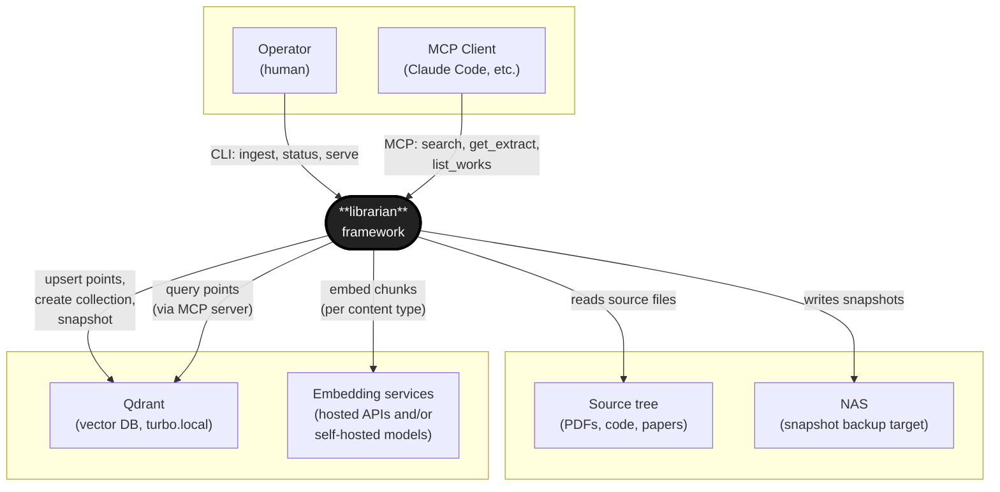

# Top-Level Context Diagram — `librarian`

**Status:** Draft · 2026-05-02
**View category:** Mixed (boundary view — relations are a mix of data flow and
invocation; appropriate for a TLCD per DSA §6.3).

## Purpose

Defines the boundary between `librarian` and its environment. Identifies every
external entity the framework interacts with and the nature of each relation.
Does not show internal structure — that lives in the module-decomposition and
runtime views.

## Diagram

## Key

- **Thick-bordered rounded block** — the system being documented (`librarian`).
- **Plain blocks** — external entities (humans, services, storage).
- **Solid arrows** — current relations.
- **Dashed arrows** — planned / future relations.
- Arrowhead points from initiator to responder.

## Element catalogue

| Entity | Kind | Relation to `librarian` |
|---|---|---|
| Operator | Human | Invokes CLI commands (`ingest`, `status`, `serve`). Provides ingest config (TOML). |
| MCP Client (Claude Code, etc.) | External software | Calls MCP tools exposed by a per-collection server: semantic search, scoped extracts, work listings. |
| Source tree | Filesystem | Read-only input. Directory of source files plus a manifest describing each file's content type and grouping. |
| NAS | Filesystem (network) | Snapshot backup target only. Receives Qdrant snapshot files via a one-shot push (HTTPS / SCP). The content-addressed cache and manifests live on the ingest host's local disk, not on NAS. |
| Qdrant | External service | Vector database backend. `librarian` creates collections, upserts points, configures payload indices, triggers snapshots, and queries at MCP serve time. |
| Embedding services | External services | Produce vectors from chunks. One adapter per provider; choice is configurable per content type. v1 ships adapters for hosted APIs (e.g. OpenAI text, Voyage code); a self-hosted model on the user's GPU host is reachable by swapping one config entry, with no core changes (F-3.4). |

## What is *not* in scope

- **Acquisition** of source material (web scraping, paper download, paywall handling) — files are assumed already on disk (F-1.2).
- **LLM generation** with retrieved context — that is the MCP client's responsibility, not `librarian`'s.
- **AuthN / multi-tenant access control** — handled by network-level controls (Tailscale / LAN), not by the framework.

## Notes

- Qdrant is shown as external because it is a separate service with its own
  lifecycle and storage. `librarian` is a *user* of Qdrant, not a wrapper around
  it — the abstraction is the `Indexer` adapter, which could in principle target
  another backend.
- The MCP server is part of `librarian` (one process per collection); the MCP
  *client* is external. The arrow direction reflects that.
- This is a TLCD. Subsystem-level context diagrams (e.g. for the pipeline alone,
  or for the MCP server alone) may be drawn later in their respective view
  documents.
