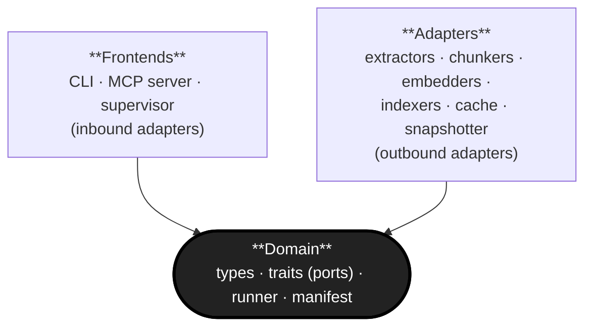

# L1 Module Decomposition — `librarian`

**Status:** Draft · 2026-05-02
**View:** Module / decomposition style, level 1 (top-level).
**Notation:** Boxes are modules; arrows are *depends-on* (DSA §1.4.1).

## Diagram

## Element catalogue

| Module | Responsibility | Depends on |
|---|---|---|
| **Domain** | Types (`Document`, `Chunk`, `ChunkPayload`, `Provenance`, `Work`); trait definitions for the outbound ports (`Extractor`, `Chunker`, `Embedder`, `Indexer`, `Cache`, `ManifestStore`, `Snapshotter`); the pipeline runner including the per-document fault boundary and fallback chain; manifest read/write logic. | (nothing) |
| **Adapters** | Concrete implementations of the outbound port traits — PDF/code/multimodal extractors, per-content-type chunkers, OpenAI/Voyage/local embedders, Qdrant indexer, filesystem cache, SQLite manifest store, Qdrant+NAS snapshotter. | Domain |
| **Frontends** | Inbound adapters that drive the Domain — CLI (`ingest`, `remove`, `status`, `start`, `stop`, …), per-collection MCP server, fleet supervisor. | Domain |

## Rules

- The Domain depends on *nothing*. No imports of `qdrant-client`, HTTP libraries, MCP libraries, filesystem code, or SDKs from Domain crates. The compiler enforces this via the Cargo workspace dependency graph.
- Adapters and Frontends both depend on Domain (they implement or call its traits) but **not on each other**. A Frontend never imports an Adapter directly; it composes them via Domain ports at startup.

## Notes

- This is L1. Each box is refined in its own L2 view when we get there (e.g. Adapters → extractors / chunkers / embedders / indexers / cache, each a separate Cargo crate).
- "Frontends" is a convenience grouping at L1; in the workspace they are separate crates / binaries.
- Runtime topology (which processes run where, how clients reach them) belongs in the C&C view, not here.
