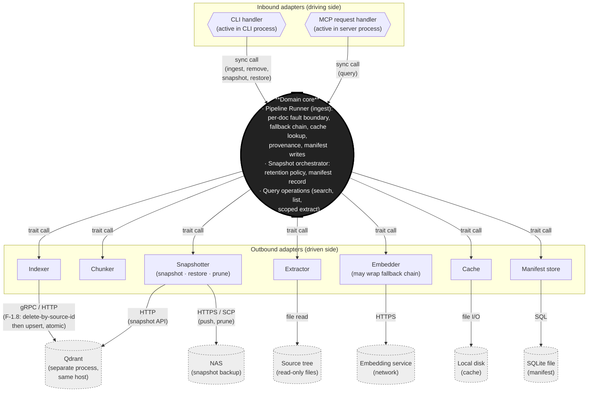

# L1 Runtime View (C&C) — `librarian`

**Status:** Draft · 2026-05-02
**View:** Component-and-connector, level 1 (one collection process, hexagonal shape).
**Notation:** Per DSA Ch 4 — boxes are components (runtime instances); arrows are connectors labelled by mechanism. The "hexagonal" framing puts the domain runner at the centre, inbound adapters above, outbound adapters around, external systems beyond the hexagon's edge.

## Scope

This view shows the runtime structure of a *single* collection process. Two process types share this shape, differing only in which inbound adapter is active:

- **CLI process** (short-lived) — instantiates the runner, runs an ingest/remove/snapshot action, exits.
- **Server process** (long-lived) — instantiates the runner, handles MCP requests until stopped.

Cross-process / multi-host topology is the Client-Server view (separate document).

**Supervisor process (separate, third type).** A long-lived process on Turbo. Its runtime is trivial: it reads/writes the fleet registry (SQLite) and spawns / waits on / signals collection-server child processes via OS calls (`fork`/`exec`, `kill`, exit-status polling). No domain logic, no adapters in the hexagonal sense — just a registry component and an OS-process-management component. Drawn here as a paragraph rather than its own diagram because there is nothing the diagram would show that this paragraph doesn't.

## Diagram

## Component catalogue

| Component | Kind | Notes |
|---|---|---|
| **Pipeline Runner** | Domain object (no I/O of its own) | Owns the control flow: fetches cache, calls stages, writes manifest, catches per-doc errors. Trait-dispatches all I/O. |
| **CLI handler** | Inbound adapter | Active only in the short-lived CLI process. Parses args, instantiates runner + adapters, calls runner, reports exit. |
| **MCP request handler** | Inbound adapter | Active only in the long-lived server process. Receives JSON-RPC requests, calls into runner's query side (search / list / scoped extract), returns results. |
| **Extractor / Chunker / Embedder / Indexer / Cache / Manifest store** | Outbound adapters | Concrete implementations of the domain's traits. Each speaks one external protocol; the runner sees only the trait. |
| **Snapshotter** | Outbound adapter | Triggers Qdrant's native snapshot API and writes the resulting file to NAS; applies rolling retention. Invoked by the domain's snapshot orchestrator (not directly by inbound adapters — that would bypass the hexagon). Snapshot/restore acts on collections wholesale, not on documents, so the pipeline runner is not involved. |

## Connector catalogue

| Connector | Mechanism | Notes |
|---|---|---|
| Inbound → Runner | Synchronous in-process function call | Same address space, same thread. |
| Runner → Outbound adapter | Synchronous trait dispatch (static or dynamic) | All in-process. The runner is unaware of the adapter's underlying protocol. |
| Embedder → embedding API | HTTPS request/response | The fallback combinator — when present — is itself an `Embedder`, so retry logic is invisible to the runner. |
| Indexer → Qdrant | gRPC or HTTP (whichever the Qdrant Rust client uses) | Same host as the collection process for v1. |
| Cache → local disk | File I/O | Content-addressed reads/writes on the ingest host's local filesystem. |
| Snapshotter → NAS | HTTPS / SCP one-shot push | Snapshot files written to NAS for backup; old snapshots pruned per retention policy. No mount; no continuous I/O. |
| Manifest store → SQLite | Local SQL queries | One file per collection. |
| Extractor → source tree | File read | Read-only. |

## Properties (runtime)

- **Concurrency.** v1 runs serially per collection process (F-1.5). Multiple collection processes coexist on the host (F-9.x); each has its own runner, adapters, manifest, and Qdrant collection target.
- **Failure domain.** A panic in any adapter is caught by the runner's per-document fault boundary (QA-F1) and recorded in the manifest. The process survives.
- **State.** The runner is stateless across documents; all persistence lives in the cache and manifest. The MCP server holds a Qdrant client connection but no other long-lived state.

## Rules

- Outbound adapters do not call each other. All composition happens in the runner.
- Inbound and outbound adapters never share a runtime object. The runner is the only meeting point.
- The same code (one Cargo workspace, one build) produces both process types. The active inbound adapter is selected at startup, not at compile time.
