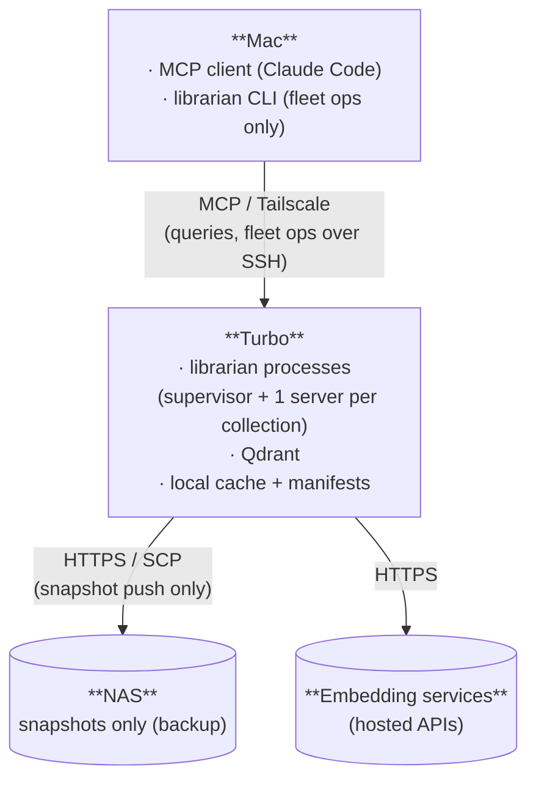

# L1 Deployment View — `librarian`

**Status:** Draft · 2026-05-02
**View:** Allocation / deployment style, level 1 (DSA Ch 5).
**Notation:** Boxes are hosts (or external services). Inner labels are software allocated to that host. Lines are network connectors, labelled by transport.

## Diagram

## Allocations

| Software / state | Host |
|---|---|
| MCP client (Claude Code) | Mac |
| `librarian` CLI (fleet ops) | Mac (commands tunnel to Turbo's supervisor) |
| `librarian` supervisor + collection servers | Turbo |
| Qdrant | Turbo |
| Content-addressed cache, manifests, fleet registry | Turbo (local disk) |
| Snapshots (backup) | NAS |
| Hosted embedder | external |

## Notes

- **Everything stateful is on Turbo.** One Qdrant, one supervisor, one cache, one set of manifests, one fleet registry. No replicas (QA-O2). Mac is a thin client.
- **NAS is for snapshots only.** Reached via HTTPS or SCP — no mount, no continuous I/O. Snapshot push is a one-shot operation triggered by the snapshot orchestrator (QA-O3).
- Future client hosts (laptops) plug in the same way Mac does — same MCP-over-Tailscale connector. Not drawn.
- A local embedder on Turbo is a configuration variant, not a deployment variant — it would replace or join the external embedder edge. Not drawn.
- Within-host process structure (supervisor spawning servers, server talking to Qdrant on localhost) is in the runtime view, not here.
