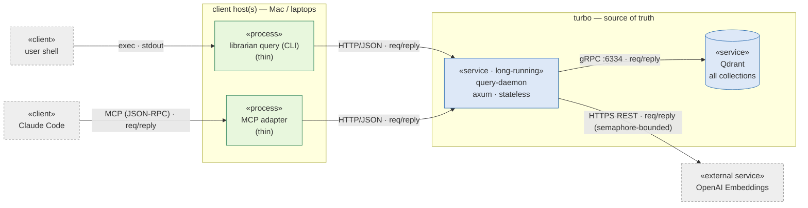
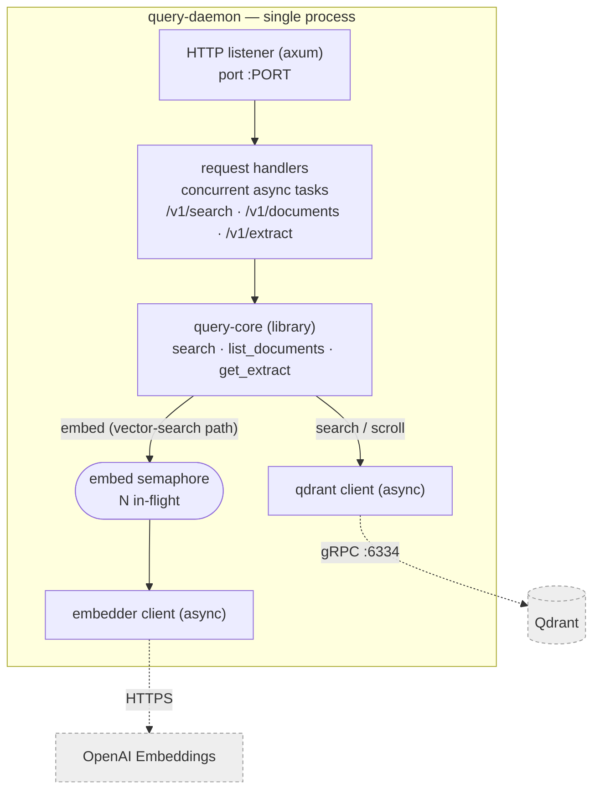

# 06 — Query service (runtime C&C view)

Component-and-connector view of the query-side evolution (PoC → production). Components
are runtime units (processes/services); connectors are labelled with protocol + style.
Requirements: `docs/requirements.md` Addendum (2026-06-03) — **F-Q.1 / F-Q.2 / QA-Q1**.

## L1 — components & connectors

## L2 — inside query-daemon (one process, async runtime)

## Legend & notes
- **«client»** external actor process · **«process»** thin client we ship · **«service»**
  long-running server · **«external service»** third-party.
- **Connectors** are request/reply (synchronous). The only bounded one is daemon→OpenAI
  (the `embed` semaphore) — the shared-key rate limit is the contention point at QA-Q1's
  "tens of users", not the daemon itself.
- **Stateless:** handlers hold no per-request/session state; shared `Arc<embedder>` +
  `Arc<qdrant_client>` only → concurrency = the axum/tokio worker pool (QA-Q1).
- **Two access paths in `query-core`:** vector-search (embed → search) and metadata-scroll
  (documents/extract, no embed — skips the semaphore).
- **Ingest is out of view** (CLI-on-turbo, unchanged).
