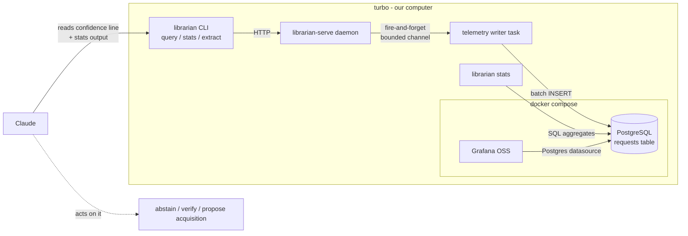

# Telemetry feature — design (issue 033, Line B)

Implements the validated design (`synthesis.md` + `e1-results.md`) as a concrete feature.
Grounded in the corpus: monitoring metrics — Building Microservices Ch.10, DDIA Ch.12;
ports & adapters — Microservices Patterns Ch.2; async non-blocking writes — async-rust.

## Stack decision (best free, self-hosted, no paid hosting)

| Concern | Choice | Why |
|---|---|---|
| System of record | **PostgreSQL** | concurrent multi-user writes (load-bearing); native Grafana source; SQL percentiles/clustering for `stats`. Replaces the earlier SQLite plan. |
| Dashboards + alerting | **Grafana OSS** | free, self-hosted, reads Postgres directly (no extra store) |
| Packaging | **Docker Compose** (postgres + grafana) on turbo | two stateful services — Compose is simpler than minikube; runs on our own box |
| Field naming | **OpenTelemetry GenAI semantic conventions** (names only) | standard `gen_ai.*`-style names without running the OTel collector/Tempo/Prometheus |

**Why not full OpenTelemetry?** Our request is a *flat 2-stage* event (embed → retrieve, optional
judge), not a deep span tree, and we serve ≤25 users. The OTel collector + Tempo + Prometheus +
Loki is 4+ extra containers of ops for tracing we do not need (synthesis §1, §4: "keep it flat";
"drop sampling infrastructure"). We adopt OTel *naming* so we can graduate to it later without a
schema rewrite. Keep it simple (project principle 3).

## Architecture



**Legend:** solid = data/request flow; dotted = Claude interpreting telemetry into an action.
Docker box = the only new infrastructure; everything else exists.

### Hexagonal write path (Microservices Patterns Ch.2)
- New **`TelemetrySink` port** (trait). Adapters: `PostgresTelemetrySink` (prod), `NullSink`
  (tests/offline). Generic over the sink — **no `Box<dyn>`** (project rule); the daemon is
  parameterised by its sink type.
- Request-log middleware already holds the confidence + timings; it builds a `RequestRecord`
  and `try_send`s it on a **bounded channel** (fire-and-forget). A background writer task drains
  the channel and **batch-inserts** (async, off the request path — async-rust grounding).
- **Telemetry must never take down the query path** (the OpenAI-incident lesson generalised):
  if the channel is full or Postgres is down, drop the record and bump a dropped counter;
  the query still returns normally.

## Postgres schema (flat Tier-1 + sampled Tier-2)

```sql
CREATE TABLE requests (
  id              uuid PRIMARY KEY,
  ts              timestamptz NOT NULL DEFAULT now(),
  user_key        text NOT NULL,          -- bearer-key identity (Line A); 'owner' until then
  session_id      text,
  channel         text NOT NULL,          -- cli | http | tailscale | cloudflare
  endpoint        text NOT NULL,          -- query | extract
  collection      text NOT NULL,
  query           text NOT NULL,          -- verbatim (disclosed to keyed users)
  query_len       int  NOT NULL,
  k               int  NOT NULL,
  status          text NOT NULL,          -- ok | empty | error
  error_type      text,
  latency_ms      int  NOT NULL,
  embed_ms        int,
  retrieve_ms     int,
  hits            int  NOT NULL,
  top_score       real,
  margin          real,
  score_spread    real,
  fragment_rate   real,
  score_vector    jsonb,                  -- full top-k scores -> offline recalibration
  confidence_value real,
  confidence_label text,                  -- strong | weak | likely_no_answer
  embed_model     text,
  index_version   text,
  est_embed_cost  numeric(10,6),
  judge_score      real,                  -- Tier-2, nullable (sampled)
  failure_category text,                  -- Tier-2, nullable
  parent_request_id uuid                  -- extract -> its parent query (implicit feedback)
);
CREATE INDEX requests_ts            ON requests (ts);
CREATE INDEX requests_user_ts       ON requests (user_key, ts);
CREATE INDEX requests_label_ts      ON requests (confidence_label, ts);
CREATE INDEX requests_collection_ts ON requests (collection, ts);
```
Indexing for analytic aggregation over an append-only event table (DDIA Ch.12). Retention: a
scheduled `DELETE WHERE ts < now() - INTERVAL '<ttl>'` (TTL configurable); verbatim-logging
disclosed in the keyed-user terms (synthesis §1, only privacy work warranted at our scale).

## Read paths

1. **`librarian query` — reporting on by default.** Already prints the `confidence:` line; keep
   it default-on, add `--quiet` to suppress. This is the per-request signal Claude consumes.
2. **`librarian stats [--since 7d] [--user U]`** — operator/Claude aggregates from Postgres:
   per-user/day counts; latency p50/p95 (`percentile_cont`); confidence-label distribution; top
   queries; **weak-query-by-frequency, clustered by embedding into topics**; per-user embed cost.
3. **Grafana** — provisioned dashboards (dashboards-as-code in the Compose config): traffic,
   latency percentiles, label mix over time, weak-query leaderboard, per-user usage + cost,
   `top_score` rolling mean/σ (drift watch).

## Claude interpretation guide (essential — Claude acts on this)

Goes into the `cw:librarian` skill so reporting is paired with *action*. The contract:

| Signal (per-query) | What it means | Claude's action |
|---|---|---|
| `strong` + on-topic hits | close, distinguishable, substantial | answer and cite normally; "the library solidly supports this" |
| `weak` but hits answer the question | tight margin / fragments — common | trust the text; verify by `extract`; proceed, no alarm |
| low `top_score` (≈<0.5) + off-topic hits | likely out-of-corpus | abstain: "the corpus doesn't appear to cover this"; do not bluff |
| `likely_no_answer` | below the (recalibrated) floor | abstain; offer to widen/rephrase |

| Signal (from `stats`) | What it means | Claude's action |
|---|---|---|
| a weak-query *cluster* recurs | demand the corpus can't meet | run the **overlap test**; if no chunk matches intent → propose acquisition; if some do → retrieval/vocab fix |
| `top_score` rolling mean drops >2σ | retrieval drift (HTTP-200 wrong answers) | flag possible degradation; suggest re-running golden health |
| one user's cost/volume spikes | runaway or abuse | surface it (ties to Line A rate limits) |

The label is a **prior**; the read of the returned text is the **verdict** (E1: the label is
mis-calibrated, so never act on the label alone).

## Recalibration (from E1)
Raise `ConfidenceThresholds.no_answer_below` 0.25 → ~0.50 (TDD the default + tests), document in
`docs/quality-standard.md`. Re-fit from logged `score_vector` once real traffic exists. Deploy
with the supervised-daemon work (changes live labels).

## Build sequence (TDD)
1. `TelemetrySink` port + `NullSink` + `PostgresTelemetrySink` (sqlx, compile-checked) + migration.
2. Request-log middleware → bounded channel → batch writer, with drop-on-full. TDD.
3. `librarian stats` command + SQL aggregates (incl. clustered weak-query view). TDD.
4. `docker-compose.yml` (postgres + grafana) + provisioned datasource & dashboards.
5. Threshold recalibration (0.25 → ~0.50) + tests.
6. `cw:librarian` skill: add the interpretation guide above.

## Multi-user (load-bearing)
`user_key` on every row (from Line A bearer keys; `owner` until then); all `stats` and Grafana
views pivot per-user; retention + per-user cost ready for the ≤25-user service. Nothing here
assumes a single user.

## Crate choices
`sqlx` (async, compile-time-checked queries, tokio-native — fits the axum daemon, no `Box<dyn>`).
Grafana + Postgres via official images. No paid services.
